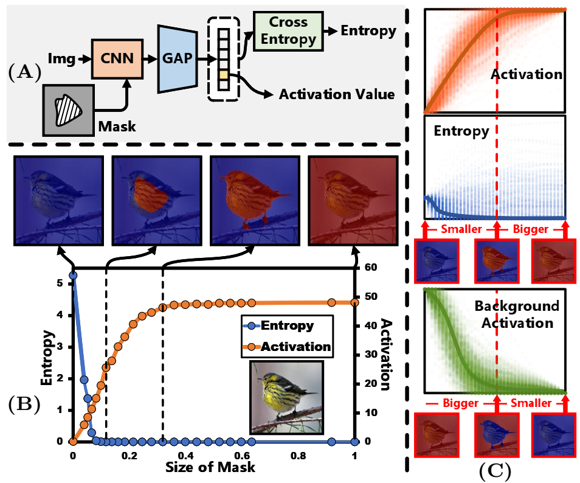

# Background Activation Suppression for Weakly Supervised Object Localization and Semantic Segmentation

PyTorch implementation of ''Background Activation Suppression for Weakly Supervised Object Localization and Semantic Segmentation''. This repository contains PyTorch training code, inference code and pretrained models. ''Background Activation Suppression for Weakly Supervised Object Localization and Semantic Segmentation'' is built upon our conference version ([CVPR 2022](https://arxiv.org/pdf/2112.00580.pdf)).

## 📋 Table of content
 1. [📎 Paper Link](#1)
 2. [💡 Abstract](#2)
 3. [✨ Motivation](#3)
 4. [📖 Method](#4)
 5. [📃 Requirements](#5)
 6. [✏️ Usage](#6)
    1. [Start](#61)
    2. [Download Datasets](#62)
    3. [WSOL task](#63)
    4. [WSSS task](#64)
 7. [📊⛺ Experimental Results and Model Zoo](#7)
 8. [✉️ Statement](#8)
 9.  [🔍 Citation](#9)

## 📎 Paper Link <a name="1"></a> 

* Background Activation Suppression for Weakly Supervised Object Localization (CVPR2022) ([link](https://arxiv.org/pdf/2112.00580.pdf))

    Authors: Pingyu Wu*, Wei Zhai*, Yang Cao
    
    Institution: University of Science and Technology of China (USTC)

* Background Activation Suppression for Weakly Supervised Object Localization and Semantic Segmentation (Extended Version) ([link]())

    Authors: Wei Zhai*, Pingyu Wu*, Kai Zhu, Yang Cao, Feng Wu, Zheng-Jun Zha

    Institution: University of Science and Technology of China (USTC) \& Institute of Artificial Intelligence, Hefei Comprehensive National Science Center

## 💡 Abstract <a name="2"></a> 
Weakly supervised object localization (WSOL) aims to localize objects using only image-level labels. Recently a new paradigm has emerged by generating a foreground prediction map (FPM) to achieve localization task. Existing FPM-based methods use cross-entropy (CE) to evaluate the foreground prediction map and to guide the learning of generator. We argue for using activation value to achieve more efficient learning. It is based on the experimental observation that, for a trained network, CE converges to zero when the foreground mask covers only part of the object region. While activation value increases until the mask expands to the object boundary, which indicates that more object areas can be learned by using activation value. In this paper, we propose a Background Activation Suppression (BAS) method. Specifically, an Activation Map Constraint (AMC) module is designed to facilitate the learning of generator by suppressing the background activation value. Meanwhile, by using foreground region guidance and area constraint, BAS can learn the whole region of the object. In the inference phase, we consider the prediction maps of different categories together to obtain the final localization results. Extensive experiments show that BAS achieves significant and consistent improvement over the baseline methods on the CUB-200-2011 and ILSVRC datasets. In addition, our method also achieves state-of-the-art weakly supervised semantic segmentation performance on the PASCAL VOC 2012 and MS COCO 2014 datasets. Code and models are available at https://github.com/wpy1999/BAS-Extension.


## ✨ Motivation <a name="3"></a> 

<p align="center">
     <br />
    <em> 
    </em>
</p>

**Motivation.** (A) The entropy value of CE loss w.r.t foreground mask and foreground activation value w.r.t foreground mask. (B) Experimental procedure and related definitions. (C) The results with statistical significance. Implementation details of the experiment and further results are available in Section 3.5.

<p align="center">
     <br />
    <em> 
    </em>
</p>

**Motivation.** Applying BAS to weakly supervised semantic segmentation task.


## 📖 Method <a name="4"></a> 

<p align="center">
     <br />
    <em> 
    </em>
</p>

**The architecture of the proposed BAS.** The architecture of the proposed BAS. In the training phase, the class-specific foreground prediction map Mf and the coupled background prediction map Mb are obtained by the generator according to the ground-truth class (GT), and then fed into the Activation Map Constraint module together with the feature map F.

<p align="center">
     <br />
    <em> 
    </em>
</p>

**Applying BAS to weakly supervised semantic segmentation task..** 

## 📃 Requirements <a name="5"></a> 
  - python 3.6.10 
  - torch 1.4.0
  - torchvision 0.5.0
  - opencv 4.5.3

## ✏️ Usage <a name="6"></a> 

### Start <a name="61"></a> 

```bash  
git clone https://github.com/wpy1999/BAS-Extension.git
cd BAS-Extension
```

### Download Datasets <a name="62"></a> 

* CUB ([http://www.vision.caltech.edu/visipedia/CUB-200-2011.html](http://www.vision.caltech.edu/visipedia/CUB-200-2011.html))
* ILSVRC ([https://www.image-net.org/challenges/LSVRC/](https://www.image-net.org/challenges/LSVRC/))
* PASCAL ([http://host.robots.ox.ac.uk/pascal/VOC/](http://host.robots.ox.ac.uk/pascal/VOC/))


### WSOL task <a name="63"></a> 

```
cd WSOL
```

> Training CUB/ OpenImages (with single gpu) <a name="63"></a> 

```
python train.py --arch ${Backbone}
```

> Training ILSVRC/ CUB/ OpenImages (with multiple gpus) <a name="63"></a> 

```
CUDA_VISIBLE_DEVICES="0,1,2,3" python -m torch.distributed.launch --nproc_per_node 4 train_ILSVRC.py
```

> Inference <a name="64"></a> 

To test the localization accuracy on CUB/ ILSVRC, you can download the trained models from Model Zoo, then run `evaluator.py`:
```bash  
python evaluator.py  
```

To test the segmentation accuracy on CUB/ OpenImages, you can download the trained models from Model Zoo, then run `count_pxap.py`:
```bash  
python count_pxap.py 
```

### WSSS task <a name="64"></a> 

> Training PASCAL <a name="63"></a> 

```
CUDA_VISIBLE_DEVICES="0,1,2,3" python -m torch.distributed.launch --nproc_per_node 4 train_bas.py
```

> Inference <a name="64"></a> 

To test the segmentation accuracy on PASCAL, you can download the trained models from Model Zoo, then run `run_sample.py`:
```bash  
python run_sample.py  
```

## 📊⛺ Experimental Results and Model Zoo <a name="7"></a> 
You can download all the trained models here ([WSOL]( https://drive.google.com/drive/folders/1H8YueyBLbfVJQk8pWil-yPVejVvCe58h?usp=sharing), [WSSS]( https://drive.google.com/drive/folders/1HkggF1NpbMnMBp14tmwZJOa5jaXemgSU?usp=sharing))

 or download any one individually as follows:

> CUB models

|  | Top1 Loc | Top5 Loc | GT Known |  Weights  |
| :-----: | :----: | :----: | :----: | :----: |
| VGG | 70.90 | 85.36 | 91.04 | [Model]( https://drive.google.com/file/d/1-1SJTaUsbSRgpV_XuBeKwfefh9cc_I8r/view?usp=sharing) |
| MobileNet | 70.54 | 86.71 | 93.04 | [Model]( https://drive.google.com/file/d/1y6U7Hhxvq8IqoRLOmnnuFFE7UUbyPvIK/view?usp=sharing) |
| ResNet | 76.75 | 90.04 | 95.41 | [Model](https://drive.google.com/file/d/1M9rSe6nwGUMqUFz5195jpA7ddnk3EjTl/view?usp=sharing) |
| Inception | 72.09 | 88.11 | 94.63 | [Model](https://drive.google.com/file/d/16UUx2t6Ga7f0TZZVm7e5awUOQmdE_fQj/view?usp=sharing) |

> ILSVRC models

|  | Top1 Loc | Top5 Loc | GT Known |  Weights  |
| :-----: | :----: | :----: | :----: | :----: |
| VGG | 52.94 | 65.38 | 69.66 | [Model]( https://drive.google.com/file/d/1lqdTmRS89vaYtld4M86LD3pzF_-7KRu8/view?usp=sharing) |
| MobileNet | 53.05 | 66.68 | 72.03 | [Model]( https://drive.google.com/file/d/1S8Ws-vmyxInlNuRD-S7ivMYbluo8M-DL/view?usp=sharing) |
| ResNet | 57.46 | 68.57 | 72.00 | [Model](https://drive.google.com/file/d/1CpeG6YTcU9Zj8_SbP0cRiPINztFzWC6z/view?usp=sharing) |
| Inception | 58.50 | 69.03 | 72.07 | [Model](https://drive.google.com/file/d/1TwcP2GNSo9Lv7V9fAb-8cieQhYJ1lhll/view?usp=sharing) |

> OpenImages

|  | PIoU | PxAP | Weights  |
| :-----: | :----: | :----: | :----: |
| ResNet | 50.72 | 66.86 | [Model]( https://drive.google.com/file/d/1PxDUkAPyWSL6zfez981SxODMSrESM5fh/view?usp=sharing) |

> PASCAL VOC models

On the PASCAL VOC 2012 training set. The results on the other baseline methods can be obtained in the same way.

|  | Seed |  Weights  | Mask |  Weights  |
| :-----: | :----: | :----: | :----: | :----: |
| Our | 57.7 | [Model]( https://drive.google.com/file/d/1VkjmAFGd0cJxHMjlPE-Qjt-mRpk6xuYh/view?usp=sharing) | 
| Our + IRN | 58.2 | [Model]( https://drive.google.com/drive/folders/1HkggF1NpbMnMBp14tmwZJOa5jaXemgSU?usp=sharing) | 71.1 |[Model]( https://drive.google.com/file/d/1QEg9Opb6JpE0rjhJMmt0YLozO20kP1Oc/view?usp=sharing)|

On the PASCAL VOC 2012 val and test sets (DeepLabv2).

|  | Val | Test |  Weights  |
| :-----: | :----: | :----: | :----: |
| Ours | 69.6 | 69.9 | [Model]( https://drive.google.com/file/d/1CzQFc04AAn8xNcTnRBV-ZkriTlbkEAKa/view?usp=sharing) |


## ✉️ Statement <a name="8"></a> 
This project is for research purpose only, please contact us for the licence of commercial use. For any other questions please contact [wpy364755620@mail.ustc.edu.cn](wpy364755620@mail.ustc.edu.cn) or [wzhai056@mail.ustc.edu.cn](wzhai056@mail.ustc.edu.cn).


## 🔍 Citation <a name="9"></a> 

```
@inproceedings{wu2022background,
  title={Background Activation Suppression for Weakly Supervised Object Localization},
  author={Wu, Pingyu and Zhai, Wei and Cao, Yang},
  booktitle={Proceedings of the IEEE/CVF Conference on Computer Vision and Pattern Recognition},
  pages={14248--14257},
  year={2022}
}
```

```
@inproceedings{wu2022background,
  title={Background Activation Suppression for Weakly Supervised Object Localization and Semantic Segmentation},
  author={Zhai, Wei and Wu, Pingyu and Zhu, Kai and Cao, Yang and Wu, Feng and Zha, Zheng-Jun},
  booktitle={xxxx},
  year={2022}
}
```
